 

🍽️ Resto – Restaurant Management System (POS + Admin Panel)
A modern, full-featured Restaurant Management System built with Flutter and Dart, designed to streamline restaurant operations such as order management, table handling, billing, and kitchen communication.
⚠️ Note: This project is currently in its first release (v1) and is actively under development.

## 🧩 Screenshots

   

  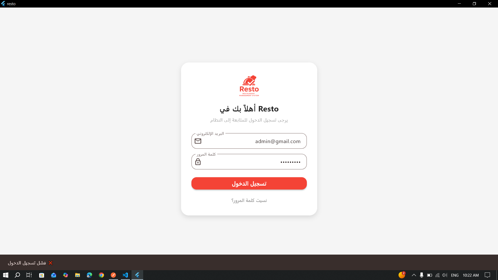
  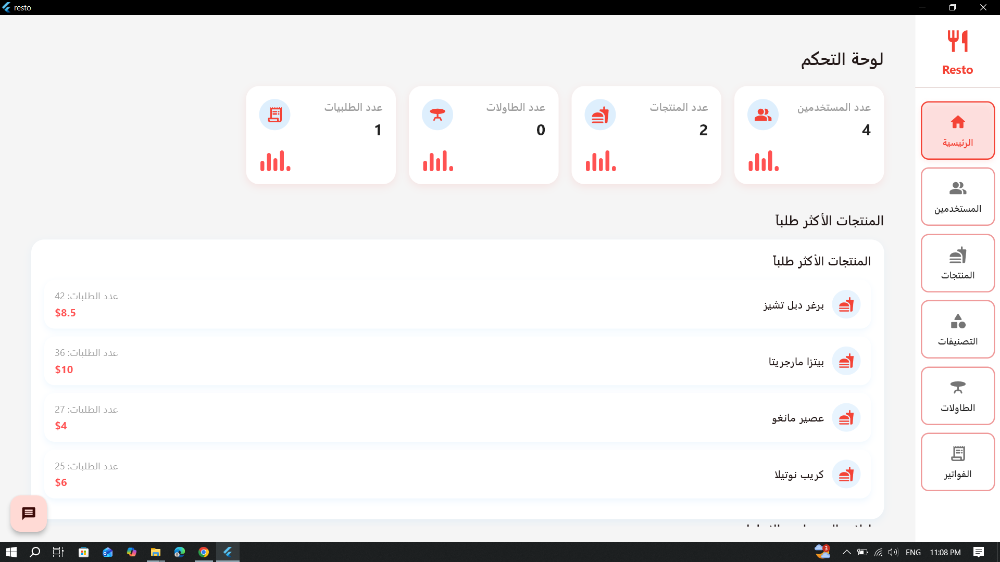
  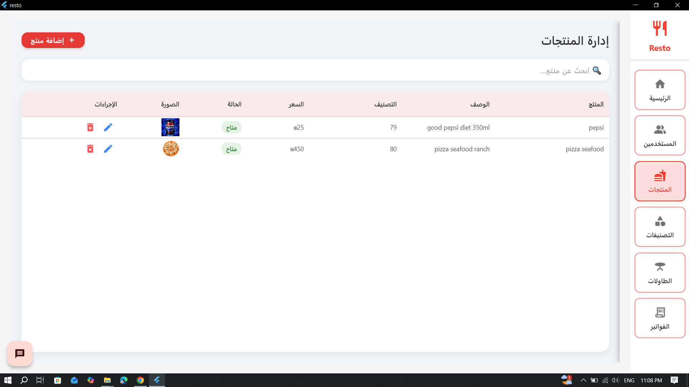
  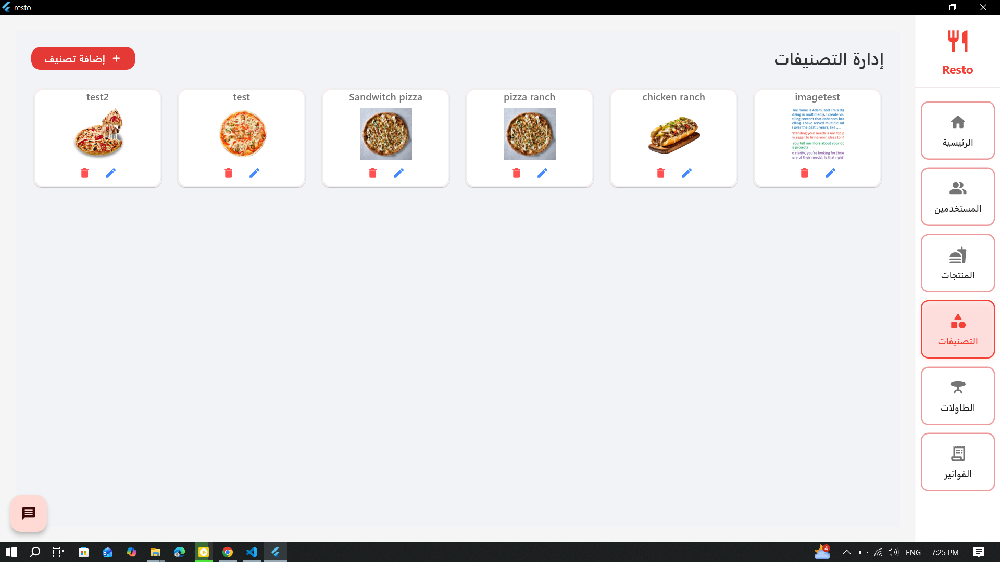
  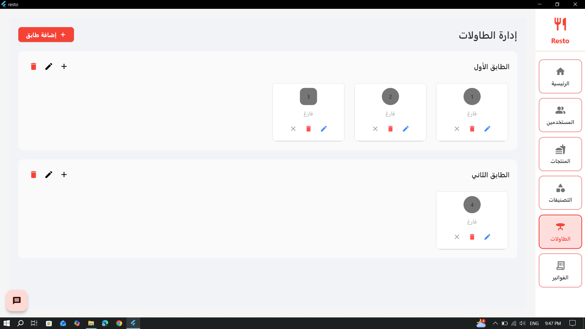
  
  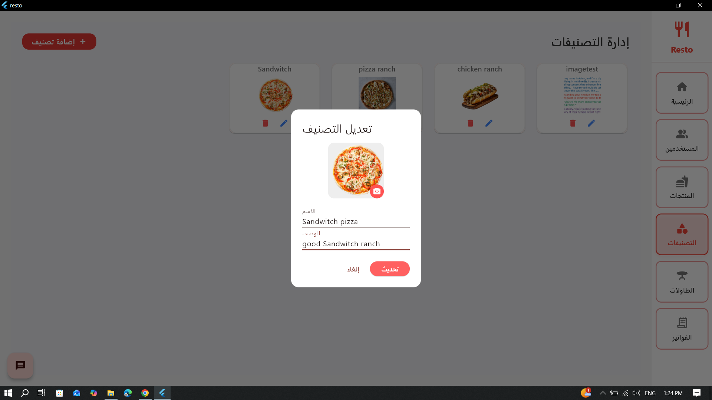
  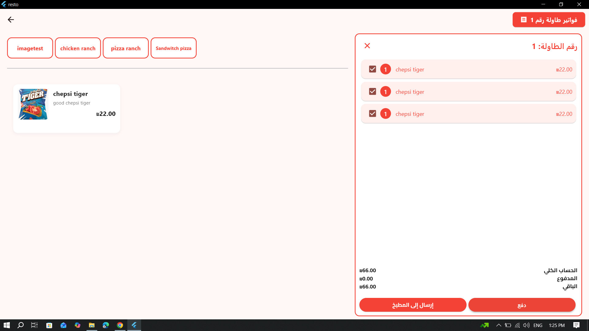
  
  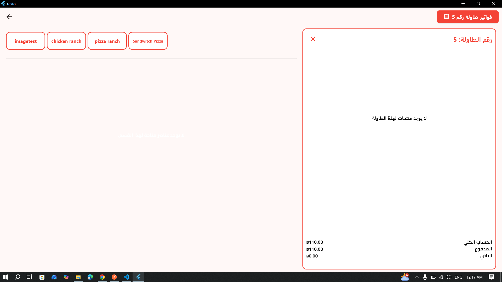
  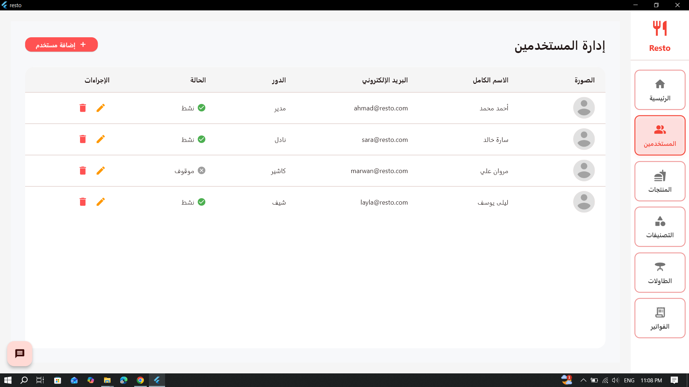
  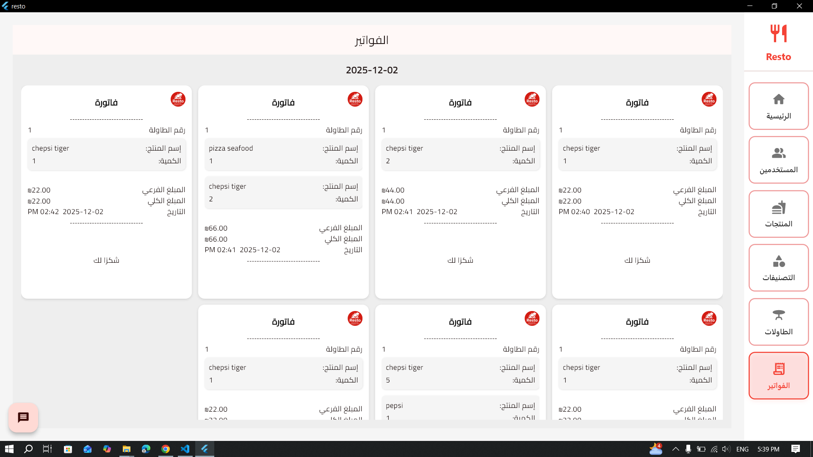
  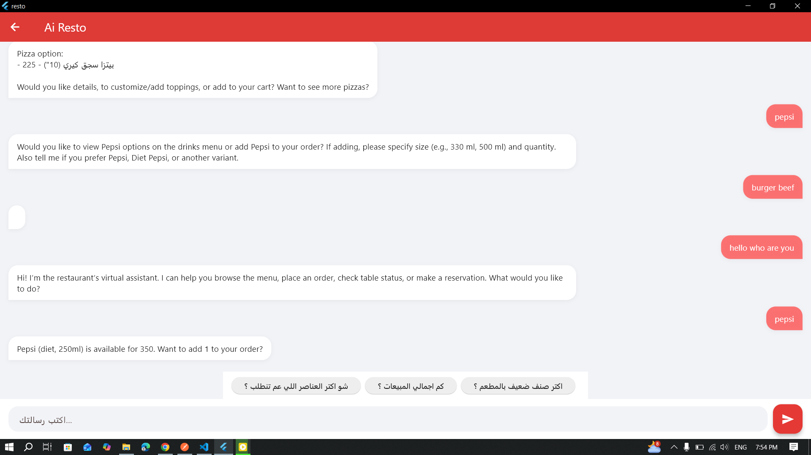
  
  

  🚀 Features

🧾 Point of Sale (POS) System
🍔 Dynamic Menu & Categories
🪑 Table & Floor Management
🛒 Cart & Order Tracking
🧾 Billing & Voucher System

👨‍🍳 Real-time Kitchen Communication

👥 User & Role Management

📊 Dashboard Analytics

🤖 AI Chatbot Integration

📷 Image Upload Support

💾 Local SQLite Storage (Offline-First)
